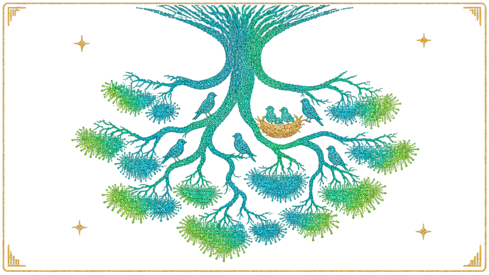

# rookery

A rookery is a place where your ideas can grow. Rookeries are collections of
files, entirely local and owned by you, with no vendor or cloud lock-in. When
rookeries are compiled with [Rheo](https://rheo.ohrg.org), every idea can be
rendered as a webpage, a PDF, or an EPUB, at any time. This is true also for
collections of ideas, ranging from a set of ideas with the same tags to your
entire rookery.

Go to the [documentation](https://rookery.ohrg.org) to get started.

For an example of a rookery in code, see the [rookery documentation source](https://github.com/freecomputinglab/rookery.ohrg.org).
